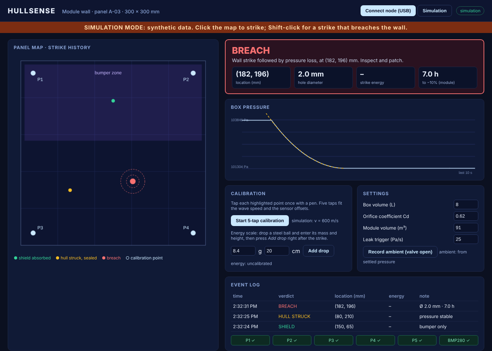
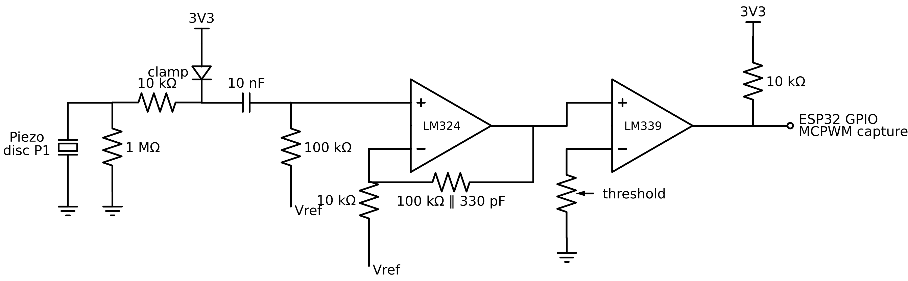
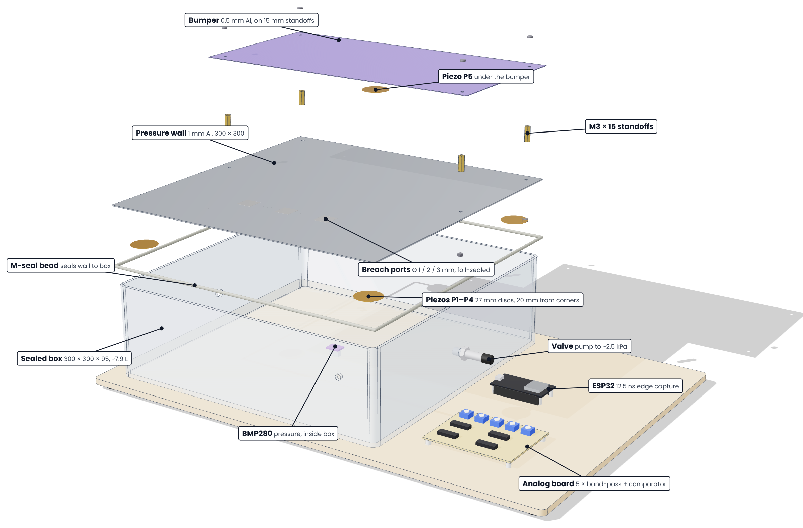

# HULLSENSE

**Real-time strike localisation and breach sizing for crewed-module walls.**
SEDHACKS '26 · Track 03 Space Instrumentation · Hardware
Team **BYTEMELATER** · Team lead **Yogeeshwaran C** · Rajalakshmi Engineering College, Chennai

When debris hits a space-station wall, the crew needs three answers fast: *where did it hit, did it breach, and how long do we have?* Today those answers can take days. On the ISS in 2020 a leak was finally found with floating tea leaves. HULLSENSE answers all three in seconds with five ₹20 piezo discs, one pressure sensor and an ESP32, for about ₹1,479.

- 📄 **Build brief and documentation:** https://yogeesh2007-bit.github.io/hullsense/
- 🖥️ **Live dashboard** (simulation mode works without hardware): https://yogeesh2007-bit.github.io/hullsense/dashboard/
- 🔧 **Firmware:** [`firmware/hullsense_node`](firmware/hullsense_node)
- 📐 **CAD model:** [`hardware/cad`](hardware/cad) (STEP assembly, STL parts, dimensioned drawing); interactive viewer at `docs/cad/`



## How it works

| Step | What happens | Where |
|---|---|---|
| 1 · Strike | A strike sends a ripple through the 1 mm aluminium wall. | test rig |
| 2 · Timing | Four corner piezos and one bumper piezo feed band-pass filters and LM339 comparators; the ESP32's MCPWM capture hardware timestamps every edge at 12.5 ns. | `firmware/` |
| 3 · Locate | The dashboard finds the point that best explains the four arrival times (least squares, after a 5-tap calibration of wave speed and sensor offsets). | `docs/dashboard/solver.js` |
| 4 · Triage | Bumper sensor first → **shield absorbed**. Wall strike with steady pressure → **hull struck, sealed**. | `solver.js · triage()` |
| 5 · Size | If box pressure falls after a wall strike, the decay curve is fitted with the orifice equation to get the hole diameter, then scaled to a station-class module with a choked-flow model → **breach: location, Ø, minutes left**. | `solver.js · fitBreach(), flightMinutes()` |

## Repository layout

```
firmware/hullsense_node/   ESP32 firmware (Arduino-ESP32 3.x)
docs/                      GitHub Pages site: build brief + live dashboard
docs/dashboard/            Web Serial dashboard (index.html, app.js, solver.js)
hardware/                  BOM, wiring, one-channel schematic
hardware/cad/              Parametric CadQuery model: STEP, GLB, STL, A3 drawing, renders
analysis/                  Python model: decay curves, hole sizing, flight scaling
tests/                     Solver tests on simulated strikes (node tests/solver.test.js)
```

## Hardware

See [`hardware/BOM.csv`](hardware/BOM.csv) and [`hardware/wiring.md`](hardware/wiring.md).

| Signal | ESP32 pin |
|---|---|
| P1 wall (20, 20) mm | GPIO 34 |
| P2 wall (280, 20) mm | GPIO 35 |
| P3 wall (20, 280) mm | GPIO 32 |
| P4 wall (280, 280) mm | GPIO 33 |
| P5 bumper | GPIO 25 |
| Timer sync (internal loop-back, leave unconnected) | GPIO 26 |
| BMP280 SDA / SCL | GPIO 21 / 22 |



## CAD model



`hardware/cad/hullsense_rig.py` is a parametric CadQuery model of the whole rig. Every dimension lives at the top of the file, and the sensor positions match `solver.js`. Run `pip install cadquery && python3 hardware/cad/hullsense_rig.py && python3 hardware/cad/drawing.py` to regenerate:

| File | What it is |
|---|---|
| `hullsense_rig.step` | Coloured assembly for Fusion 360, SolidWorks, FreeCAD or Onshape |
| `hullsense_rig.glb`, `hullsense_rig_exploded.glb` | Web and Blender versions (used by the viewer in `docs/cad/`) |
| `stl/*.stl` | Wall plate, bumper, box, standoff and base board as separate parts |
| `hullsense_rig_drawing.pdf` | A3 workshop drawing: wall layout, section A–A and parts list |

## Build and flash the firmware

1. Arduino IDE 2.x → Boards Manager → install **esp32 by Espressif, version 3.x** (tested with 3.0.7).
2. Library Manager → install **Adafruit BMP280 Library**.
3. Open `firmware/hullsense_node/hullsense_node.ino`, board **ESP32 Dev Module**, upload.
4. Serial output is JSON lines at 921600 baud (`evt`, `p`, `hb`).

Build check: compiles for ESP32 Dev Module with Arduino-ESP32 3.0.7, using 317 KB flash (24%) and 21 KB RAM (6%).

## Run the dashboard

Open https://yogeesh2007-bit.github.io/hullsense/dashboard/ in Chrome or Edge.

- **With the node:** *Connect node (USB)* → *Start 5-tap calibration* → tap the five highlighted points → strike the panel.
- **Without hardware:** *Simulation* → click the map to strike, Shift-click for a strike that breaches the wall.

## Tests

```
node tests/solver.test.js
python3 analysis/hullsense_model.py
```

The solver test recovers wave speed and sensor offsets from 5 simulated taps, locates 25 simulated strikes, and sizes simulated 1, 2 and 3 mm breaches. These are simulations; bench numbers from the real rig go in `analysis/results.md` once measured.

## Status and honest limits

- Lab strikes (dropped balls, punches), not 7 km/s hypervelocity impacts. The demo proves the locate → triage → size pipeline.
- Location accuracy target: median ≤ 2.5 cm on a 25-point grid. Hole-size target: within ±15%. Both are targets until the bench tests are logged.
- Prices for the ESP32, piezo and BMP280 were checked online in October 2026; the rest are estimates.

## Licence

MIT. NASA photographs used in the documentation are public domain.
